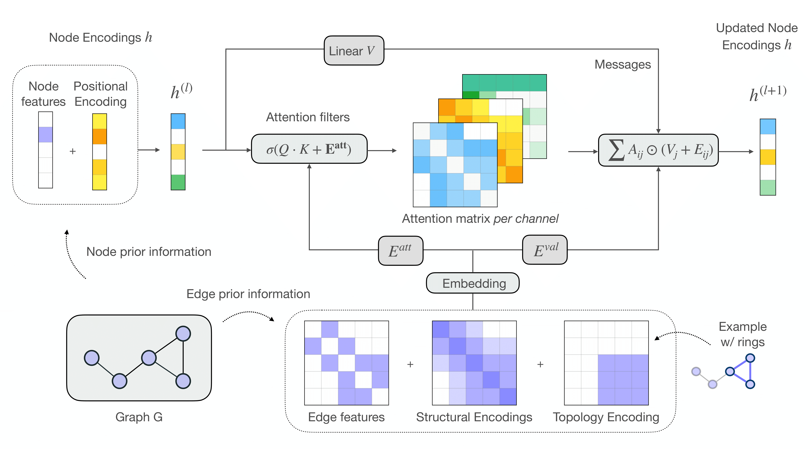

# CSA: Self-Attention in Colors

Official implementation of the graph transformer presented in:
[](TODO)

This repository was initially forked off the [GraphGPS](https://github.com/rampasek/GraphGPS) repository



### Python environment setup with Conda

```bash
conda create -n csa python=3.9
conda activate csa

conda install pytorch=1.10 torchvision torchaudio -c pytorch -c nvidia
conda install pyg=2.0.4 -c pyg -c conda-forge

# RDKit is required for OGB-LSC PCQM4Mv2 and datasets derived from it.  
conda install openbabel fsspec rdkit -c conda-forge

pip install torchmetrics
pip install performer-pytorch
pip install ogb
pip install tensorboardX
pip install wandb

conda clean --all
```


### Running CSA
```bash
conda activate csa

# Running CSA with RWSE and tuned hyperparameters for ZINC.
python main.py --cfg configs/CSA/zinc-CSA+RWSE.yaml  wandb.use False

# Running a debug/dev config for ZINC.
python main.py --cfg tests/configs/graph/zinc.yaml  wandb.use False
```


### Benchmarking GPS on 4 datasets
See `run/run_experiments.sh` script to run multiple random seeds per each of the 11 datasets. We rely on Slurm job scheduling system.

Alternatively, you can run them in terminal following the example below. Configs for all 11 datasets are in `configs/GPS/`.
```bash
conda activate csa
# Run 10 repeats with 10 different random seeds (0..9):
python main.py --cfg configs/CSA/zinc-CSA+RWSE.yaml  --repeat 10  wandb.use False
# Run a particular random seed:
python main.py --cfg configs/GPS/zinc-CSA+RWSE.yaml  --repeat 1  seed 42  wandb.use False
```


### W&B logging
To use W&B logging, set `wandb.use True` and have a `gtransformers` entity set-up in your W&B account (or change it to whatever else you like by setting `wandb.entity`).


### Unit tests

To run all unit tests, execute from the project root directory:

```bash
python -m unittest -v
```

Or specify a particular test module, e.g.:

```bash
python -m unittest -v unittests.test_eigvecs
```


## Citation

If you find this work useful, please cite our paper:
```
citation
```
